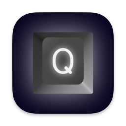
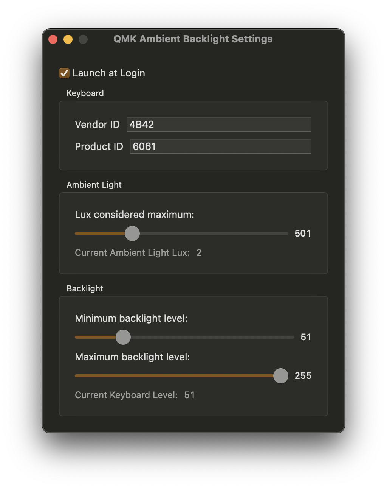

# QMK Ambient Backlight

Automatically set your keyboard's backlight based on your Mac's ambient light sensor.

## Compatibility

**macOS Big Sur or later and a Mac with a built-in ambient light sensor.**

Your keyboard must be running the [QMK](https://qmk.fm/) firmware, with the following additional requirements:

 * A decent number of levels set for `BACKLIGHT_LEVELS` in your `config.h` (e.g. 10–20 or more)

### And Either

 * VIA enabled (`VIA_ENABLE = yes` in your `rules.mk`)

### Or

 * `RAW_ENABLE = yes` in your `rules.mk`
 * The contents of [example-keymap.c](./example-keymap.c) included in your `keymap.c`

## Instructions

The application will monitor the ambient light sensor and send a backlight value to the firmware in the range 0–255. Either VIA or a handler in `raw_hid_receive()` will map that range into the range set for `BACKLIGHT_LEVELS` in your keymap's `config.h`.

# Download

QMK Ambient Backlight is available for free, and it's also open-source. If you prefer, you can pay any amount you'd like in order to support my work.

[Get the latest build on Gumroad](https://gum.co/QMKAmbientBacklight).

# Acknowledgements

This is my first macOS/SwiftUI project. Most of the project structure was inspired by and the entirety of the code for the ambient light sensor was taken from [DarkModeBuddy](https://github.com/insidegui/DarkModeBuddy) by Guilherme Rambo.
